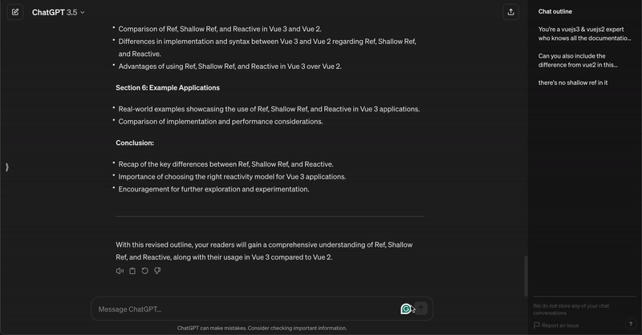
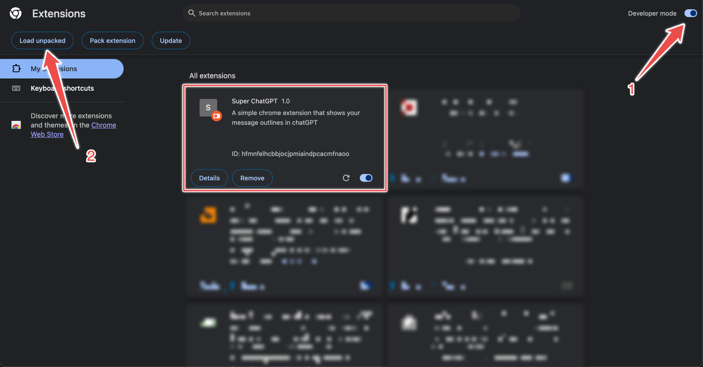

# ChatGPT Boost extension

## Demo video
This extension will create a table of content for your chat conversations. It will help you to navigate through the chat easily.

** We do not read/store any of your chat conversations

## How to use
Download the extension.zip file from [here](extension.zip) and extract it.

Go to Manage extensions or directly enter `chrome://extensions/` in your browser
1. Enable Developer mode
2. Click on Load unpacked
3. Select the extracted folder
4. Upload it and you are good to go

Facing any issues? Message me [here](https://twitter.com/iamsaban)
